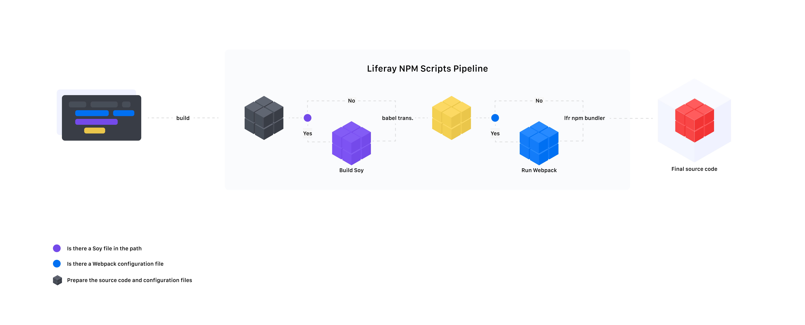

# DXP Build Process

This article describes how the build process works in DXP, with a high-level view that provides a deeper understanding of what goes on behind the scenes. It does not describe the fine details and there are many links to other articles that discuss parts of the process in more detail.

## Build module

The build pipeline of the source code of the modules in DXP is made by a set of tools that are concentrated in the CLI [liferay-npm-scripts](https://github.com/liferay/liferay-npm-tools/tree/master/packages/liferay-npm-scripts) that abstracts some configurations that are necessary to perform the build. Think of it as a zero-config arrangement to get you started.

> `liferay-npm-scripts` does not only deal with the build but also with [formatting](./formatting.md), [storybook](https://github.com/storybookjs/storybook#getting-started), themes, testing...



Just like a regular JavaScript package, you can add the `liferay-npm-scripts build` task to your `package.json` as a `build` task. It gets run via `yarn build` automatically when `gradlew deploy` is executed. All artifacts are added to an OSGi bundle that is later deployed to DXP.

When running `liferay-npm-scripts build` it executes other tools in a sequence; depending on the environment in which it is being run, it will trigger different tools (e.g. webpack and Soy).

1. Setup environment
2. Validate the `npmscripts.config.js` file if it exists
3. Build [Soy](http://metaljs.com/docs/guides/soy-components.html#soy_compilation) files, if any
4. Build [Babel](https://babeljs.io/) transformation
5. Run [webpack](https://webpack.js.org/) if the `webpack.config.js` file exists
6. Run [`liferay-npm-bundler`](https://github.com/liferay/liferay-js-toolkit/tree/master/packages/liferay-npm-bundler)
7. Run [`liferay-npm-bridge-generator`](https://github.com/liferay/liferay-js-toolkit/tree/master/packages/liferay-npm-bridge-generator) when a `.npmbridgerc` is present

The CLI does a lot for you, like [configuring Babel, ESLint, Jest, npm-bundler, Prettier and Stylelint](https://github.com/liferay/liferay-npm-tools/tree/master/packages/liferay-npm-scripts/src/config). You don't need to configure these when using liferay-npm-scripts, but you can overwrite the base settings by adding config files for the respective tools; the CLI will take your settings and merge them with the defaults.

### Build Pipeline

Following the sequence we can briefly describe in more detail what happens in each phase.

By default the CLI expects its source code to be in `src/main/resources/META-INF/resources` and it outputs into the `build/node/packageRunBuild/resources` folder.

#### 1. Setup environment

By default `NODE_ENV` is set to `production`. You can override it by configuring `env NODE_ENV=development liferay-npm-scripts build` but due to aggressive caching by Gradle, there are some caveats to take into consideration; read the article [Environment](./environment.md) for more details on this subject, including ways to make this configuration persistent.

#### 2. Validate `npmscripts.config.js`

The CLI will validate the `npmscripts.config.js` configuration file looking for required keys, just to avoid errors that are difficult to track later.

> You can read more about the [npmscripts.config.js settings](https://github.com/liferay/liferay-npm-tools/tree/master/packages/liferay-npm-scripts#config) in the [liferay-npm-tools](https://github.com/liferay/liferay-npm-tools) repository.

#### 3. Soy

If there are any `.soy` files in the module, `liferay-npm-scripts` will build Soy templates and then run `babel` on the generated `.js` files before dropping them into the build destination folder. Unlike the other phases, before executing the `babel` the Soy build will compile your `.soy` code in a temporary folder (by default in `build/npmscripts`) from where `babel` can transform it and send it to the final destination folder.

The CLI runs [`metalsoy`](https://github.com/metal/metal-tools-soy/tree/4.x) to handle the Soy files.

#### 4. Babel

As part of the build process, [Babel](https://babeljs.io/) is used for transformation. This allows us to use React with JSX syntax, for example, and to allow the use of [new JavaScript features](https://github.com/tc39/proposals/blob/master/finished-proposals.md).

-   [Default configuration of Babel in liferay-npm-scripts](https://github.com/liferay/liferay-npm-tools/blob/master/packages/liferay-npm-scripts/src/config/babel.json)

#### 5. webpack

The CLI can also run [webpack](https://webpack.js.org/) as part of the process if there is a [`webpack.config.js`](https://webpack.js.org/configuration/#options) configuration file.

> The CLI will also merge the [Babel config](https://github.com/liferay/liferay-npm-tools/blob/master/packages/liferay-npm-scripts/src/config/babel.json) with the `webpack.config.js` configuration if the loader `babel-loader` is present in the configuration.

#### 6. Liferay npm bundler

Running [liferay-npm-bundler](https://github.com/liferay/liferay-js-toolkit/tree/master/packages/liferay-npm-bundler) allows your project's dependencies and source code to be converted to [AMD](https://en.wikipedia.org/wiki/Asynchronous_module_definition) so that they can be deployed as an OSGi package later. So, Liferay Portal will be able to load the files of your module and its dependencies when requested.

> Read the ["Bundler v2 imports"](./bundler_imports.md) to understand at a technical level why we need it and how it works.

-   [Default bundler preset](https://github.com/liferay/liferay-npm-tools/blob/master/packages/liferay-npm-bundler-preset-liferay-dev/config.json)

#### 7. Liferay npm bridge generator

The `liferay-npm-bridge-generator` is only executed when there is a `.npmbridgerc` configuration file in the module. This is an extra step that generates bridge modules (npm modules that re-export another module in the same package) inside a project.

> To learn more about how to use this tool read ["How to use liferay npm bridge generator" in the wike of the liferay-js-toolkit repository](https://github.com/liferay/liferay-js-toolkit/wiki/How-to-use-liferay-npm-bridge-generator).

### Build SCSS

DXP handles the SCSS build using the [CSS Builder Gradle Plugin](https://github.com/liferay/liferay-portal/blob/master/modules/sdk/gradle-plugins-css-builder/README.markdown). You will see what it does later.

There are two ways to load the final CSS files:

-   Load the main CSS file via Java
-   Load independent CSS files via JavaScript

The Gradle plugin is executed as part of the `gradlew deploy` build pipeline and expects the `.scss` files to be in the module's `src/main/resources` folder. The [`CSSBuilder`](https://github.com/liferay/liferay-portal/blob/master/modules/util/css-builder/src/main/java/com/liferay/css/builder/CSSBuilder.java) class compiles the input, and the [`CSSRTLConverter`](https://github.com/liferay/liferay-portal/blob/master/modules/apps/frontend-css/frontend-css-rtl-servlet/src/main/java/com/liferay/frontend/css/rtl/servlet/internal/converter/CSSRTLConverter.java) class creates the [RTL](https://en.wikipedia.org/wiki/Right-to-left) files for the final CSS.

Once compiled, SCSS files can be loaded via Java or JavaScript.

For Java they are usually defined in the module's portlets, and in JavaScript they are imported in any application file. The `com.liferay.portlet.header-portlet-css` property defines the path to the final CSS file that adds the CSS path to the HTML output of the request, [as seen in this example](https://github.com/liferay/liferay-portal/blob/7c83e4f8a48aabf902f1feceff0072242494186d/modules/apps/dynamic-data-mapping/dynamic-data-mapping-form-web/src/main/java/com/liferay/dynamic/data/mapping/form/web/internal/portlet/DDMFormAdminPortlet.java#L72)).

In JavaScript files, the [css-loader](https://github.com/liferay/liferay-js-toolkit/tree/master/packages/liferay-npm-bundler-loader-css-loader) is executed in the Liferay npm bundler, which consequently is part of the build flow of `liferay-npm-scripts`. The difference is that you can import a `.css` or `.scss` file in JavaScript file.

> When a file is a SCSS they are not compiled by the `css-loader` but by the Gradle plugin and consequently the loader takes care of loading its final file.

```js
import './button.scss';
// or
import './button.css';
```

The output of the loader creates a JavaScript file with the name of the CSS file including the suffix `scss` or `css` that takes care of loading the final CSS file, similar to this:

```js
(function () {
	var link = document.createElement('link');
	link.setAttribute('rel', 'stylesheet');
	link.setAttribute('type', 'text/css');
	link.setAttribute(
		'href',
		Liferay.ThemeDisplay.getPathContext() +
			'/o/module-name/Button/Button.css'
	);

	function defineModule() {
		Liferay.Loader.define(
			'module-name@1.0.0/Button/Button.scss',
			['module', 'exports', 'require'],
			function (module, exports, require) {
				var define = undefined;

				module.exports = link;
			}
		);
	}

	link.onload = defineModule;

	link.onerror = function () {
		console.warn(
			'Unable to load /o/module-name/Button/Button.css. However, its .js module will still be defined to avoid breaking execution flow (expect some visual degradation).'
		);
		defineModule();
	};

	document.querySelector('head').appendChild(link);
})();
```

The call sequence is something like: `Button.js -> Button.scss.js -> Button.scss`.

## Build themes

The build pipeline for themes is essentially for customers who want to create and maintain themes. There are two CLI tools that are responsible for dealing with themes:

-   [Liferay Theme Generator](https://github.com/liferay/liferay-js-themes-toolkit/tree/master/packages/generator-liferay-theme): A Yeoman generator which generates new themes to be used with Liferay Portal
-   [Liferay Theme Tasks](https://github.com/liferay/liferay-js-themes-toolkit/tree/master/packages/liferay-theme-tasks): Multiple gulp tasks available to expedite theme development.

The build can be initiated by the `gulp build` or `gulp deploy` tasks; both will trigger the theme build. In overview, the `gulp build` process looks like this:

1. Copy theme base to build path
2. Copy source code to build path
3. Prepare `WEB-INF`, "Look and Feel" and `liferay-hook.xml`
4. Build themelets
5. Build CSS
6. Build R2
7. Build WAR

The result of the build process is a standard file structure that can extend from a base theme or themelet and is organized to be added to a `.war` file that gets deployed to a local appserver or a remote server.

All builds steps result from [running this list of gulp tasks in sequence](https://github.com/liferay/liferay-js-themes-toolkit/blob/a67d15026051c2397e7d6e0c64e62594ad99c2e9/packages/liferay-theme-tasks/theme/tasks/build/index.js#L72-L90) within a stream or not.

### Theme base

When a theme is created you need to choose a base theme to start with. There are two options: `unstyled` and `styled`. In the build phase the CLI looks for `liferayTheme.baseTheme` in `package.json` in the theme folder so that it can copy the base theme's `src` files to the build path (by default in `./Build`). This is used later in the CSS build phase.

### WEB-INF

The `liferay-look-and-feel.xml` and `liferay-hook.xml` files, among others, are part of the process of building a Liferay theme; both are built during the process and are added in the `WEB-INF` folder of the build.

### Themelets

Think of themelets as small components, fragments of CSS code and JS that can be reused by various themes, or as the basis for a new theme as well.

The CLI looks for themelets inside the `node_modules` of the project and copies the source files to the build path, just like the theme base phase. The themelet is injected into the template: for example, for JavaScript in `portal_normal.ftl` and for CSS in `_custom.scss`.

### R2

R2 is a helper that helps to get the CSS to achieve cross-language layout-friendly (including bi-directional text). The CLI goes through all the CSS files and generates a [RTL](https://en.wikipedia.org/wiki/Right-to-left) variant for each file.
