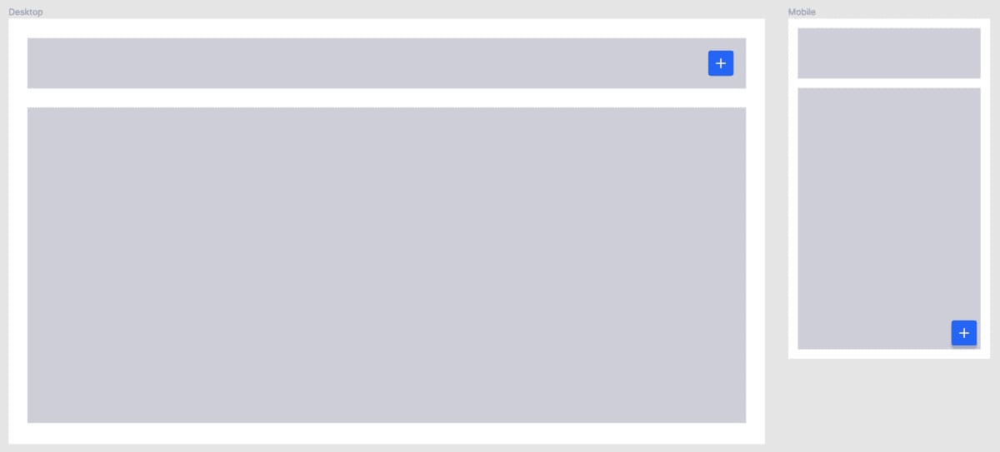

# How to write responsive CSS?

To understand how to create a good responsive CSS

## 1. What is responsiveness?

For definition a responsive website is a website that can be shown correctly on every device. But what does it mean from a developer point of view?

The main idea behind a responsive application is to create CSS rules in order to adapt the content to all the device sizes without losing the design identity.

The main tool we use for this task is the CSS media-query function

```scss
// SCSS example media-query
.fjord-button {
    // @media (min-width: 992px) {...}
    @include media-breakpoint-up(lg) {...} // Bootstrap mixin, recommended
}
```

Thanks to the media-queries we are able to set rules that apply only to some devices or screen sizes.

Since Clay is usually the boilerplate for our products, we should use the [provided mixins and breakpoints](https://github.com/liferay/clay/blob/master/packages/clay-css/src/scss/bootstrap/mixins/_breakpoints.scss) to create consistency throughout the whole application.

## 2. What is mobile first?

The term "mobile first" was born in a Visual/UX context where it's extremely important to create the design starting from the mobile version and going up covering all the devices

In CSS, it's ok to start developing from the desktop design, sometimes it has a higher priority or we don't have access to the mobile version

The real problem appears when we start adding CSS rules in order to create the small version of our application.

```scss
// SCSS example bad
.fjord-text {
	font-size: 1.5rem;

	//@media (max-width: 768px) {
	@include media-breakpoint-down(sm) {
		font-size: 1rem;
	}
}
```

```scss
// SCSS example good
.fjord-text {
	font-size: 1rem;

	//@media (min-width: 768px) {
	@include media-breakpoint-up(sm) {
		font-size: 1.5rem;
	}
}
```

In a standard scenario, desktops have higher rendering capabilities and better internet connections, so they can easily afford more design complexity.

Since small devices need more attentions from developers, we prefer to make the mobile version of our application as simple and light as possible.

To create a good responsive, we should prevent CSS overwrites in the mobile version, a good trick is to avoid using `@media (max-width: value) {` but it's not always valid



There are 2 ways to obtain that result in the example image

> We are going to omit the code we need to create the button and focus only on the position

```scss
// SCSS example bad
.fjord-header-button-plus {
	position: fixed;
	right: 2rem;
	bottom: 2rem;
	z-index: 10; // z-index should be a variable

	//@media (min-width: 768px) {
	@include media-breakpoint-up(sm) {
		position: initial;
		right: initial;
		bottom: initial;
		z-index: initial;
	}
}
```

```scss
// SCSS example good
.fjord-header-button-plus {
	//@media (max-width: 768px) {
	@include media-breakpoint-down(xs) {
		position: fixed;
		right: 2rem;
		bottom: 2rem;
		z-index: 10; // z-index should be a variable
	}
}
```

In this example you can see how sometimes we recommend to use `@media (max-width: value) {` when it creates a lighter code

## 3. What about the HTML?

From the beginning CSS and HTML have always been the perfect _couple_, this time is not different.

In order to get a good responsive we should keep unchanged the natural order of the DOM on mobile, and use CSS to obtain the desired design on desktop.


```html
// HTML
<div class="module-a"></div>
<div class="row-1">
	<div class="module-b"></div>
	<div class="module-c"></div>
</div>
```

```scss
// SCSS example bad
.row-1 {
	//@media (max-width: 768px) {
	@include media-breakpoint-down(sm) {
		display: flex;
		flex-direction: column;
	}
}
.module-b {
	//@media (max-width: 768px) {
	@include media-breakpoint-down(sm) {
		flex-order: 1;
	}
}
```

```scss
// SCSS example good
.row-1 {
	//@media (min-width: 768px) {
	@include media-breakpoint-up(sm) {
		display: flex;
		flex-direction: row;
	}
}
.module-b {
	//@media (min-width: 768px) {
	@include media-breakpoint-up(sm) {
		flex-order: 1;
	}
}
```
