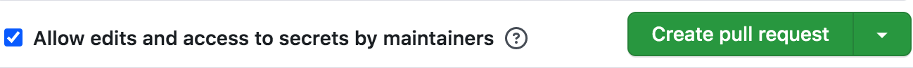

# Frontend Infrastructure Team code review process

These are guidelines that the Frontend Infrastructure Team follows when developing code for Liferay DXP. While some of the details are specific to our team, we're sharing them here because they may prove useful to other teams as well in the development of their own code review processes.

## Guidelines

1.  **Send PRs for code review to [liferay-frontend/liferay-portal](https://github.com/liferay-frontend/liferay-portal).** This provides us with a global view of team progress and CI status, and gives us a common place to coordinate our efforts.
2.  **Follow our best practice guidelines for preparing pull requests.** Our [general advice about preparing pull requests](https://github.com/liferay/liferay-frontend-projects/blob/master/guidelines/general/pull_requests.md) also applies to the liferay-frontend/liferay-portal repo.
3.  **Always provide a description.** In order to expedite review, give the reviewer(s) all the context they need to understand what your PR aims to do, and any analysis that you undertook to arrive at your solution (this can include a description of alternatives that you _didn't_ select, and why) (see [example](https://github.com/liferay-frontend/liferay-portal/pull/2)).

    **One important gotcha here:** If you create a PR without a description (for example, with the `gh` tool) and then edit the PR to provide one, people you `@`-mention in the description will _not_ receive a notification. This is also true for `@`-mentions added when editing comments. For this reason, it is recommended that you create PRs using the GitHub UI, so that you can provide the description at the time of creation. Alternatively, be sure to `@`-mention people in a separate comment after creating the PR.

4.  **Always provide a test plan.** This is part of the description, and consists of the steps you took to verify that your change is correct (see [example](https://github.com/liferay-frontend/liferay-portal/pull/34)). This serves two purposes: one is to enable the reviewer to easily check your PR (if they deem it necessary); the other is to provide the reviewer with information that may save them the effort of testing it themselves (that is, if your test plan is good, the reviewer can feel more confident about the change).
5.  **Always assign a reviewer.** All team members are collaborators on the repo and may be assigned as reviewers. Proactively selecting reviewers and `@`-mentioning them will minimize the amount of time your pull sits unattended in the queue.
6.  **Use the assignee to make current ownership clear.** If multiple people are involved in a pull, designate the person who is responsible for moving the pull to the next step as the assignee. For example, the assignee could be a person doing deep review of a change, or rebasing an outdated pull, or diagnosing CI failures; it need not be the author of the change.
7.  **Use labels to make current status clear.** We have labels such as "awaiting response", "needs update", "forwarding", and so on to make it clear what the next steps are for each pull. Note that we even have "approved" and "changes requested" labels (which actually duplicate the indications that the GitHub UI provides) to make the status totally obvious.
8.  **Ensure quality by analyzing test results.** At the time of writing, even a pull with a green CI result and "no unique failures" should be carefully inspected before running `ci:forward`, and specifically, "failures in common with upstream" should be examined to make sure that the pull does not introduce _additional_ failure that happens to overlap with existing failure in the upstream. If in doubt, ask QA for help, either in the `#d-quality-assurance` Slack channel, or directly mentioning our QA on GitHub or in the team Slack channel.
9.  **Allow edits from maintainers.** When you create your pull, please be sure check the "Allow edits and access to secrets by maintainers" box at the bottom of the pull request form. This allows other collaborators on the repo to push to the pull's corresponding branch on your fork, thus updating the pull. This can save wasteful round trips, which can be expensive due to time-zone delays.

    

    Note that if you create PRs with [the `gh` command-line tool](https://www.npmjs.com/package/gh) you obviously can't see or check a checkbox. In that case, you may wish to add the people who most frequently review your code as [collaborators to your repo](https://help.github.com/en/github/setting-up-and-managing-your-github-user-account/inviting-collaborators-to-a-personal-repository), as well as the team members who tend to be generally involved in code review:

    -   [bryceosterhaus](https://github.com/bryceosterhaus)
    -   [javierdearcos](https://github.com/javierdearcos)
    -   [markocikos](https://github.com/markocikos)
    -   [matuzalemsteles](https://github.com/matuzalemsteles)

10. **For traceability, prefer updating existing pulls rather than creating new ones.** GitHub's UI isn't great for following conversation threads in long-lived pulls, but keeping the conversation in one place _does_ make it less likely that important information will be overlooked. Adding additional commits to an existing pull is a good way to show incremental change in response to a review. Force pushing makes it harder to see what changed, but may be necessary if you must rebase. Likewise, you may squash commits if necessary to avoid confusing history and intermediate broken states from entering the upstream repo. Finally, if the conversation gets too messy, you can declare bankruptcy and create a new PR (always remember to link back to the prior one so that the history can be traced), or split conversation off [into an issue](https://github.com/liferay-frontend/liferay-portal/issues) (we have issues enabled on the repo for exactly this purpose).
11. **Use custom searches to focus on relevant pulls.** See [the GitHub docs](https://help.github.com/en/github/searching-for-information-on-github/searching-issues-and-pull-requests) for help on creating bookmarks that show you pulls that are of most interest to you. Examples may include the following, but there are many other possibilities:
    -   `is:pr is:open author:USERNAME`: Open PRs by USERNAME.
    -   `is:pr is:open assignee:USERNAME`: Open PRs assigned to USERNAME.
    -   `is:pr sort:created-desc mentions:USERNAME`: All PRs mentioning USERNAME, ordered by recency.
    -   `is:pr sort:created-desc commenter:USERNAME`: All PRs commented on by USERNAME, ordered by recency.
    -   `is:pr is:open involves:USERNAME`: Open PRs involving USERNAME (ie. as author, commenter, mentionee, or assignee).
    -   `is:pr is:open review-requested:USERNAME`: Open PRs to be reviewed by USERNAME.
    -   `is:pr is:open no:assignee`: Open PRs with no assignee.
12. **Watch the repo so that you can be notified when new PRs arrive.** Even when you are not an explicit reviewer or assignee of a change, you can learn useful knowledge and information by being aware of what is going on in the repo. See the following section for information about filtering notifications.

    

## Filtering and notifications

Given that watching the repo can produce a large number of notifications, you may wish to configure email filters to highlight the issues where you are requested as a reviewer or explicitly mentioned. As described in [the GitHub documentation on email notifications](https://help.github.com/en/github/managing-subscriptions-and-notifications-on-github/configuring-notifications#filtering-email-notifications), GitHub will CC an account of the form `something@noreply.github.com` to indicate why you are receiving a particular email (eg. `mention@noreply.github.com` would be CC'd to indicate that you were mentioned in a PR or issue). Additionally, some of this information is redundantly encoded in `X-GitHub-*` headers.

A partial list of examples follows, but see the documentation for a complete list of the other notification types (eg. `assign`, `push` etc).

### Example 1: Activity on a pull in which you were mentioned

```
To: "liferay-frontend/liferay-portal" <liferay-portal@noreply.github.com>
Cc: Greg Hurrell <greg@hurrell.net>, Mention <mention@noreply.github.com>
X-GitHub-Sender: julien
X-GitHub-Recipient: wincent
X-GitHub-Reason: mention
```

From this we can derive:

-   The reason the email is being sent (a mention), thanks to `X-GitHub-Reason` and CC address of `mention@noreply.github.com`.
-   The mentioned GitHub user (`wincent`) and corresponding email address (`greg@hurrell.net`).
-   The GitHub user of the author of the comment (`julien`).

**Note:** Once you have been mentioned on a pull, _every_ subsequent comment on that pull will trigger a notification, even if the new comment doesn't explicitly mention you again. As such, you might want to configure an additional filter criterion to look for text matching `@your-github-username` in the email body and give matching messages special emphasis.

### Example 2: Review request

```
To: "liferay-frontend/liferay-portal" <liferay-portal@noreply.github.com>
Cc: Greg Hurrell <greg@hurrell.net>, Review requested <review_requested@noreply.github.com>
X-GitHub-Sender: jbalsas
X-GitHub-Recipient: wincent
X-GitHub-Reason: review_requested
```

Again, we can derive:

-   Reason (review requested) from `X-GitHub-Reason` or the CC address of `review_requested@noreply.github.com`.
-   Reviewer GitHub user account and email address.
-   Requester GitHub account.

Closely related to the `review_request` type is the `assign` notification.

### Example 3: Your own activity

It's possible to configure GitHub to send you notifications even of your own activity (eg. when you post a comment). This is useful so that your email archive can contain a complete record of your conversations around a pull request; however, you may want mark emails concerning your own activity as read.

```
To: "liferay-frontend/liferay-portal" <liferay-portal@noreply.github.com>
Cc: Greg Hurrell <greg@hurrell.net>, Your activity <your_activity@noreply.github.com>
X-GitHub-Sender: wincent
X-GitHub-Recipient: wincent
X-GitHub-Reason: your_activity
```

As before, we can see:

-   Reason (own activity) from `X-GitHub-Reason` or the CC address of `your_activity@noreply.github.com`.
-   GitHub user account and email address.

## Keeping the [liferay-frontend/liferay-portal](https://github.com/liferay-frontend/liferay-portal) repo up-to-date

Please see ["liferay-frontend repo sync"](https://liferay.atlassian.net/wiki/spaces/ENGFRONTENDINFRA/pages/1409615973/liferay-frontend+repo+sync) in [Confluence](https://liferay.atlassian.net/wiki/home).
