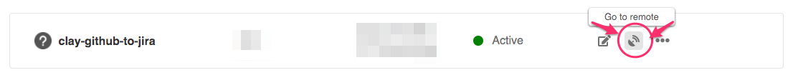
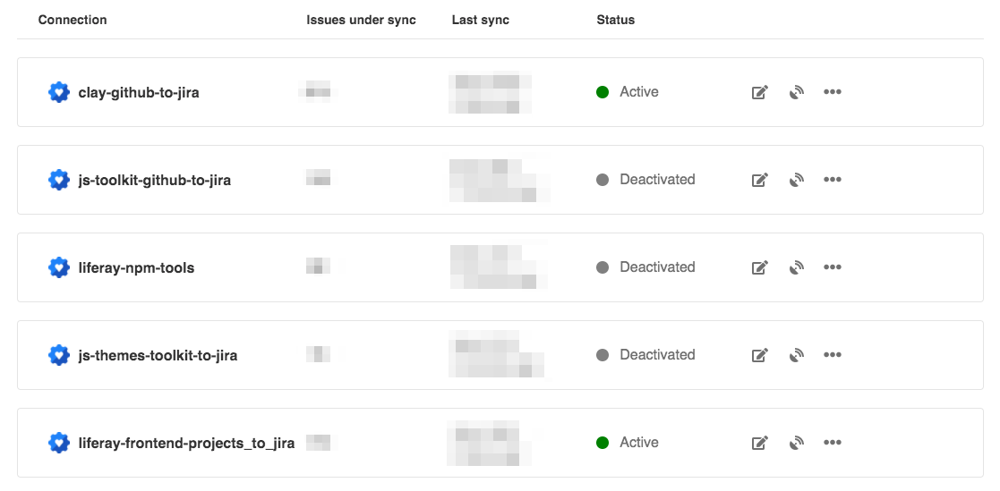

# GitHub to JIRA Synchronization

Frontend Infra uses [Exalate](https://exalate.com/) to monitor some GitHub-first projects and make sure we can easily track their progress in a single workflow rather than having different data-gathering scenarios.

## Usage

We use Exalate to sync the following projects:

-   [`liferay/clay`](https://github.com/liferay/clay) ([Configuration](./clay.md))
-   [`liferay/liferay-frontend-projects`](https://github.com/liferay/liferay-frontend-projects) ([Configuration](./liferay-frontend-projects.md))

> ⚠️ Projects are setup to **unidirectionally sync from GitHub to JIRA.**
>
> Even though Exalate allows for bi-directional synchronization, only actions in GitHub will trigger updates in JIRA and not the other way around. The resulting JIRA tickets are not meant to be updated and the only real way to interact with the projects is through GitHub. This way we simplify the workflow and maintain a single point of entry.

## Notes

Below are some general notes explaining the current state of our setup, and showing how to navigate between JIRA and Exalate to edit the necessary scripts.

### General

-   The 2 main [general Exalate concepts](https://docs.idalko.com/exalate/display/ED/General+Exalate+concepts) are:
    -   **[Connection](https://docs.idalko.com/exalate/display/ED/Connection)**: defines how issues are synchronized. It includes information about the instances you are syncing, describes how these instances are related to each other, and how the information is mapped.
    -   **[Triggers](https://docs.idalko.com/exalate/display/ED/Triggers)**: You can start issue synchronization automatically according to a specified search query with the help of a trigger. If the issue fits a search query it is triggered for synchronization automatically. Once someone updates the issue which is under sync the changes are synchronized automatically.

### JIRA

-   The Exalate app is installed in the issues.liferay.com JIRA server
-   It requires admin permissions to manage it and can't be accessed otherwise
-   To **access** navigate to `JIRA Administration` > `Manage Apps` > `Exalate`
-   **Current license is valid until 2021-10-15**. Details can be found in the `License Details` tab in JIRA
-   There are currently 3 configured connections. The 2 owned by the Frontend Infrastructure team are [`clay-github-to-jira`](./clay.md) and [`liferay-frontend-projects_to_jira`](./liferay-frontend-projects.md) and can be configured clicking on their `Edit Connection` button.

### GitHub

-   **The GitHub Exalate admin console requires admin permissions on the repos being edited**
-   Each connection in JIRA can correspond to a different Exalate endpoint managing the connection to GitHub. To locate the Exalate node syncing with a connection, click the `Go to Remote` button in the Connection description as seen in the image:

-   Currently, both projects are configured in the same exalate node.
-   There are currently 5 configured connections. Only the 2 that correspond to [`clay-github-to-jira`](./clay.md) and [`liferay-frontend-projects_to_jira`](./liferay-frontend-projects.md) remain active. The others were deactivated as those projects got folded into either of the 2 remaining ones.

