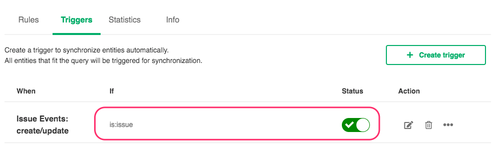
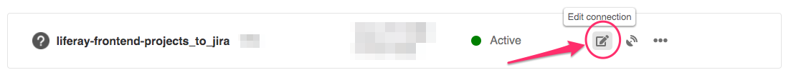

# liferay/liferay-frontend-projects GitHub to JIRA syncrhonization

This document describes the workflow between the [liferay/liferay-frontend-projects](https://github.com/liferay/liferay-frontend-projects) project in GitHub and issues.liferay.com.

> ⚠️ Issues are unidirectionally synced **from GitHub to JIRA.**

## GitHub Setup

Since the setup is mostly unidirectional, the GitHub side is pretty simple and basically just prepares an event payload every time an action is triggered in the repo.

1. To manage the liferay-frontend-projects connection, [locate the liferay-frontend-projects Exalate remote](./README.md) and navigate to it.
2. Navigate to `Connections` > `clay-github-to-jira` > `Edit Connection`


3. Verify or Update Triggers setup. At the moment, only one trigger is necessary: `is:issue`



4. Verify or Update the rules setup. Copy paste current values from the code snippets below and update them when necessary so they're always up-to-date.

#### Outgoing Sync

```groovy
def convertToANSI = { String it ->
    return new String(it.getBytes("ISO-8859-1"), "ISO-8859-1")
}

replica.key            = issue.key
replica.assignees      = issue.assignees
replica.summary        = convertToANSI(issue.summary)
replica.description    = convertToANSI(issue.description)
replica.labels         = issue.labels
replica.comments       = issue.comments.collect { it.body = convertToANSI(it.body); it }
replica.status         = issue.status
replica.fixVersions    = issue.fixVersions
```

#### Incoming sync

```groovy
//one-way sync (from Github to Jira)
```

## JIRA Setup

1. To manage the Clay connection, navigate to issues.liferay.com and go to `JIRA Administration` > `Manage Apps` > `Exalate`.
2. Navigate to `Connections` > `clay-github-to-jira` > `Edit Connection`



3. Verify or Update Triggers setup. **There should be no trigger** since actions in JIRA should not trigger a syncing effect towards GitHub.


4. Verify or Update the rules setup. Copy paste current values from the code snippets below and update them when necessary so they're always up-to-date.

#### Outgoing Sync

```groovy
replica.key            = issue.key
replica.type           = issue.type
replica.assignee       = issue.assignee
replica.summary        = issue.summary
replica.description    = issue.description
replica.labels         = issue.labels
replica.comments       = issue.comments
replica.status         = issue.status
```

#### Incoming sync

```groovy
import com.atlassian.jira.component.ComponentAccessor

final def labelTypeMapping = [
     "bug"         : "Bug"
    ,"regression"  : "Bug"
    ,"chore"       : "Task"
    ,"enhancement" : "Story"
]

issue.projectKey   = "IFI"

def labelType = replica.labels.find { it.label.startsWith("type:") }?.label
def typeMapped = labelTypeMapping[labelType?.replace("type:", "")?.trim()?.toLowerCase()]
issue.typeName     = nodeHelper.getIssueType(typeMapped, issue.projectKey)?.name ?:
                         (nodeHelper.getDefaultIssueType(issue.projectKey)?.name ?: "Task")

issue.assignee     = findUser(replica.assignees[0])
issue.reporter     = userHelper.getByUsername("exalate")
issue.summary      = replica.summary
issue.description  = replica.description
issue.labels       = replica.labels.collect { it.label = it.label.replace(" ", "_"); it }
issue.comments     = commentHelper.mergeComments(issue, replica,
                         { comment ->
                             def userAuthor = findUser(comment.author)
                             if (userAuthor.username == "team-frontend-infra")
                                 comment.body = comment.author.displayName + " commented: \n" +
                                     "{quote}\n" +
                                     comment.body + "\n" +
                                     "{quote}\n"
                             else
                                 comment.executor = userAuthor
                          })

def milestoneIssueKey = replica.fixVersions[0]?.name =~ /[\w]+-[\d]+/
def issueEpic = ComponentAccessor.getIssueManager().getIssueObject(milestoneIssueKey ? milestoneIssueKey[0] : "")
issue.customFields."Epic Link".value = issueEpic?.getIssueType()?.getName() == "Epic" ? issueEpic : null

final def transitionsMapping = [
    transitions: [
        [ name:'Exl to "In Progress"'  , to:'In Progress']
    ]
]

def targetStatus = null
if (replica.assignees.size() > 0)
    targetStatus = "In Progress"

def transition = transitionsMapping.transitions.find { it.to == targetStatus }
if (transition)
    workflowHelper.transition(issue, transition.name)


// --- functions --- //
def findUser(replicaUser) {
    if (!replicaUser)
        return null

    def user = userHelper.getByUsername(replicaUser.username)

    if (user && user.active && userHelper.isGroupMember(replicaUser.username, "liferay-staff"))
        return user

    final def usernameMapping = [
        "brunofernandezg": "bruno.fernandez"
        ,"bryceosterhaus": "bryce.osterhaus"
        ,"carloslancha": "carlos.lancha"
        ,"diegonvs": "diego.nascimento"
        ,"dsanz": "daniel.sanz"
        ,"eduardoallegrini": "Eduardo.allegrini"
        ,"izaera": "ivan.zaera"
        ,"javierdearcos": "javier.dearcos"
        ,"jbalsas": "jose.balsas"
        ,"julien": "julien.castelain"
        ,"kresimir-coko": "kresimir.coko"
        ,"LuismiBarcos": "luismiguel.barco"
        ,"marcoscv-work": "marcos.castro"
        ,"markocikos": "marko.cikos"
        ,"matuzalemsteles": "matuzalem.teles"
        ,"nhpatt": "javier.gamarra"
        ,"pablo-agulla": "pablo.agulla"
        ,"pat270": "patrick.yeo"
    ]
    def usernameMapped = usernameMapping[replicaUser.username];
    if (usernameMapped) {
        user = userHelper.getByUsername(usernameMapped)
        if (user && user.active)
            return user
    }

    return userHelper.getByUsername("team-frontend-infra")
}
```
